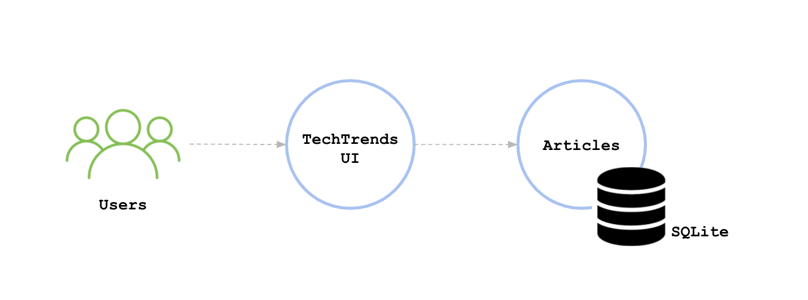

# Techtrends - packaging, deploying and applying CI/CD Techniques  
 A project submission for Udacity Data Engineer for AI Applications Nanodegree

## Introduction

TechTrends is an online website used as a news sharing platform, that enables consumers to access the latest news within the cloud-native ecosystem. In addition to accessing the available articles, readers are able to create new media articles and share them.

This submission aims to package and deploy TechTrends to Kubernetes using a CI/CD pipeline.

The web application is written using the Python Flask framework. It uses SQLite, a lightweight disk-based database to store the submitted articles.

Below are the main components of the first prototype of the application:

## Project files
   - __project__
     - [Vagrantfile](project/Vagrantfile) contains the configuration for the vagrant box. It is used to create a vagrant box locally.
     - __argocd__ contains the ArgoCD manifests
       - [README.md](project/argocd/README.md)
       - [helm\-techtrends\-prod.yaml](project/argocd/helm-techtrends-prod.yaml)
       - [helm\-techtrends\-staging.yaml](project/argocd/helm-techtrends-staging.yaml)
     - [docker\_commands](project/docker_commands) is used to record any used Docker commands and outputs
     - __helm__ contains the Helm chart files
       - [Chart.yaml](project/helm/Chart.yaml)
       - [README.md](project/helm/README.md)
       - __templates__
         - [deployment.yaml](project/helm/templates/deployment.yaml)
         - [namespace.yaml](project/helm/templates/namespace.yaml)
         - [service.yaml](project/helm/templates/service.yaml)
       - [values\-prod.yaml](project/helm/values-prod.yaml)
       - [values\-staging.yaml](project/helm/values-staging.yaml)
       - [values.yaml](project/helm/values.yaml)
     - __kubernetes__ contains Kubernetes declarative manifests
       - [README.md](project/kubernetes/README.md)
       - [deploy.yaml](project/kubernetes/deploy.yaml)
       - [namespace.yaml](project/kubernetes/namespace.yaml)
       - [service.yaml](project/kubernetes/service.yaml)
     - __screenshots__ contains all screenshots of the packaging and deploments as well as Github actions
       - [README.md](project/screenshots/README.md)
       - [argocd\-techtrends\-prod.PNG](project/screenshots/argocd-techtrends-prod.PNG)
       - [argocd\-techtrends\-staging.PNG](project/screenshots/argocd-techtrends-staging.PNG)
       - [argocd\-ui.PNG](project/screenshots/argocd-ui.PNG)
       - [ci\-dockerhub.PNG](project/screenshots/ci-dockerhub.PNG)
       - [ci\-github\-actions.PNG](project/screenshots/ci-github-actions.PNG)
       - [docker\-run\-local.PNG](project/screenshots/docker-run-local.PNG)
       - [k8s\-nodes.PNG](project/screenshots/k8s-nodes.PNG)
       - [kubernetes\-declarative\-manifests.PNG](project/screenshots/kubernetes-declarative-manifests.PNG)
     - __techtrends__
       - [Dockerfile](project/techtrends/Dockerfile)
       - [README.md](project/techtrends/README.md)
       - [\_\_init\_\_.py](project/techtrends/__init__.py)  is a reserved method used to indicate that a directory is a Python package
       - [app.py](project/techtrends/app.py) contains the main logging of the TechTrends application
       - [init\_db.py](project/techtrends/init_db.py)  is a file that is used to initialize the posts database with a set of articles
       - [requirements.txt](project/techtrends/requirements.txt) contains a list of packages that need to be installed before running the TechTrends application
       - [schema.sql](project/techtrends/schema.sql) outlines the posts database schema
       - __static__ contains the CSS files
         - __css__
           - [main.css](project/techtrends/static/css/main.css)
       - __templates__ outlines the HTML structure of the TechTrends application
         - [404.html](project/techtrends/templates/404.html)
         - [about.html](project/techtrends/templates/about.html)
         - [base.html](project/techtrends/templates/base.html)
         - [create.html](project/techtrends/templates/create.html)
         - [index.html](project/techtrends/templates/index.html)
         - [post.html](project/techtrends/templates/post.html)

## Tools needed
- Python
- Git
- Docker
- Vagrant
- VirtualBox

## Project steps
- Run project locally for testing that everything is fine
- Healthcheck, Metrics and Logs endpoints were added
- Packaging techtrends using Docker
- Adding CI manifest in Github actions
- Creating deployment manifests for deploying techtrends using kubernetes using vagrant box and K3s. 
- Creating Helm charts to orchestrate the deployment process
- Applying CD using ArgoCD

## How to run locally
- Initialize the database by using the python init_db.py command. This creates or overwrites (if the file already exists) the database.db file that is used to store and access the available posts.
- Run the TechTrends application by using the python app.py command. The application is running on port 3111 and you can access it by querying the http://127.0.0.1:3111/ endpoint.
